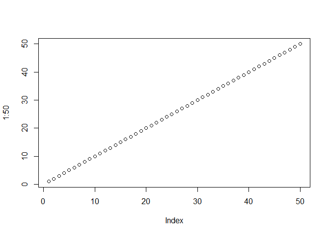

Class06
================
Zhuohang Wu
January 24, 2019

### Class06

Section 1 : reading files again
-------------------------------

HahHahaHahahAhHAhahahahahahAhaahaHaHahaahaHaAhAH!!!!!!!!!!

``` r
plot(1:50)
```



HehehHehheHEHeHehehehHeheheHhEhEhehehEHhEh!!!!!!!

``` r
read.table("https://bioboot.github.io/bimm143_W19/class-material/test1.txt", header= TRUE, sep=",")
```

    ##   Col1 Col2 Col3
    ## 1    1    2    3
    ## 2    4    5    6
    ## 3    7    8    9
    ## 4    a    b    c

``` r
read.table("https://bioboot.github.io/bimm143_W19/class-material/test2.txt", header=TRUE, sep="$")
```

    ##   Col1 Col2 Col3
    ## 1    1    2    3
    ## 2    4    5    6
    ## 3    7    8    9
    ## 4    a    b    c

``` r
read.table("https://bioboot.github.io/bimm143_W19/class-material/test3.txt", col.names = c("A","B","C"), row.names = c("!","@","#","$","%"), sep="")
```

    ##   A  B C
    ## ! 1  6 a
    ## @ 2  7 b
    ## # 3  8 c
    ## $ 4  9 d
    ## % 5 10 e

``` r
data1 <- read.csv("https://bioboot.github.io/bimm143_W19/class-material/test1.txt")
data1
```

    ##   Col1 Col2 Col3
    ## 1    1    2    3
    ## 2    4    5    6
    ## 3    7    8    9
    ## 4    a    b    c

``` r
data2 <- read.csv("https://bioboot.github.io/bimm143_W19/class-material/test2.txt")
data2
```

    ##   Col1.Col2.Col3
    ## 1          1$2$3
    ## 2          4$5$6
    ## 3          7$8$9
    ## 4          a$b$c

``` r
data3 <- read.csv("https://bioboot.github.io/bimm143_W19/class-material/test3.txt")
data3
```

    ##   X1...6...a
    ## 1  2   7   b
    ## 2 3   8   c 
    ## 3  4   9   d
    ## 4  5   10  e

``` r
A_Math_Problem <- function(x)
{
 y <- (x^4) 
 z <-( y+9)
 print(y)
 print(z)
}

A_Math_Problem(2)
```

    ## [1] 16
    ## [1] 25

``` r
A_Math_Problem(56)
```

    ## [1] 9834496
    ## [1] 9834505

``` r
library(bio3d)
Kinase <- function(s){
  s1 <- read.pdb("4AKE") # kinase with drug
  s2 <- read.pdb("1AKE") # kinase no drug
  s3 <- read.pdb("1E4Y") # kinase with drug
  if(s ==  1){
    s1.chainA <- trim.pdb(s1, chain="A", elety="CA")
    s1.b <- s1.chainA$atom$b
    plotb3(s1.b, sse=s1.chainA, typ="l", ylab="Bfactor")
    return()
  }
  if(s <-  2){
    s2.chainA <- trim.pdb(s2, chain="A", elety="CA")
    s2.b <- s2.chainA$atom$b
    plotb3(s2.b, sse=s1.chainA, typ="l", ylab="Bfactor")
    return
  }
  if(s <-  3){
    s3.chainA <- trim.pdb(s1, chain="A", elety="CA")
    s3.b <- s3.chainA$atom$b
    plotb3(s3.b, sse=s1.chainA, typ="l", ylab="Bfactor")
    return
  }
}
```

``` r
Kinase(1)
```

    ##   Note: Accessing on-line PDB file
    ##   Note: Accessing on-line PDB file
    ##    PDB has ALT records, taking A only, rm.alt=TRUE
    ##   Note: Accessing on-line PDB file


    ## NULL
