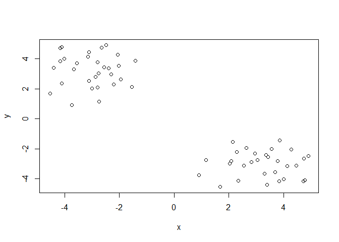
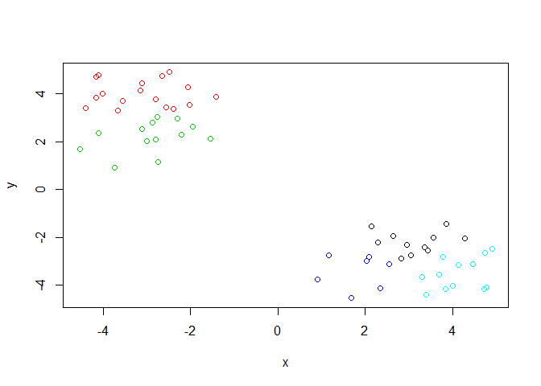
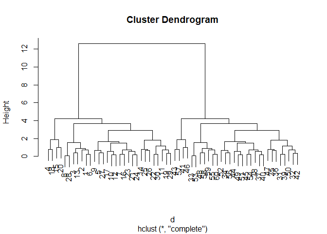
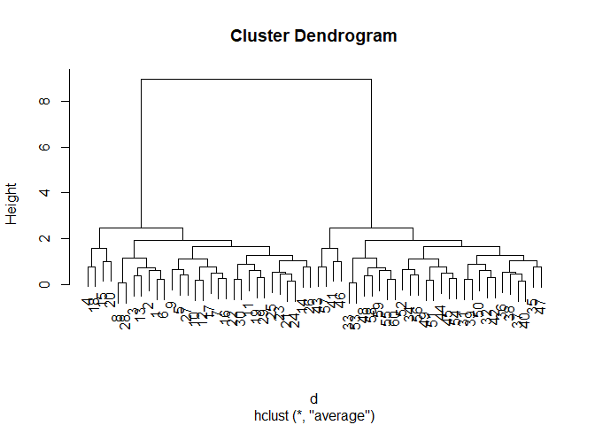
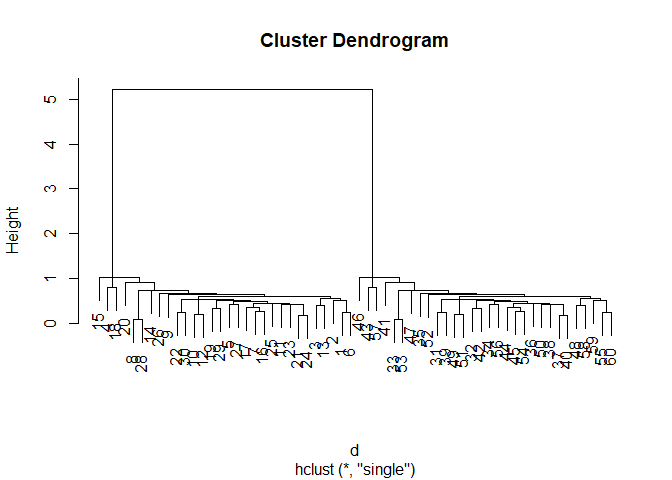
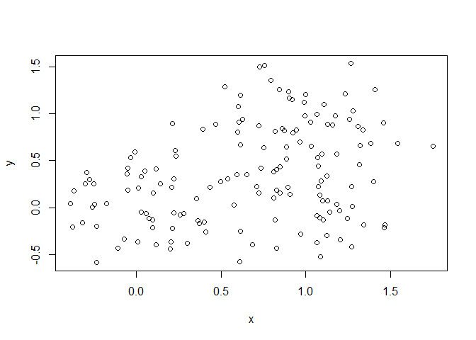
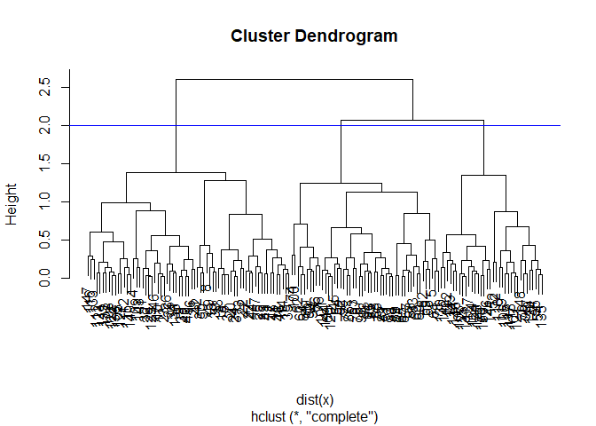
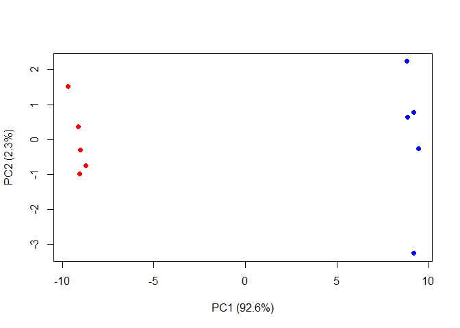

Class08
================
Zhuohang Wu
February 5, 2019

``` r
# Generate some example data for clustering
tmp <- c(rnorm(30,-3), rnorm(30,3))
x <- cbind(x=tmp, y=rev(tmp))
plot(x)
```



``` r
y <- kmeans(x,centers = 5,nstart = 30)
y
```

    ## K-means clustering with 5 clusters of sizes 11, 17, 13, 7, 12
    ## 
    ## Cluster means:
    ##           x         y
    ## 1  3.127695 -2.188666
    ## 2 -3.101853  4.019390
    ## 3 -2.898218  2.206283
    ## 4  1.826448 -3.435095
    ## 5  4.151793 -3.523945
    ## 
    ## Clustering vector:
    ##  [1] 2 2 2 3 3 2 3 2 3 3 2 3 2 2 3 3 3 3 2 3 2 2 3 2 2 2 3 2 2 2 5 5 5 1 1
    ## [36] 1 1 1 5 1 4 5 4 4 1 4 1 5 4 5 4 1 5 1 5 1 4 5 5 5
    ## 
    ## Within cluster sum of squares by cluster:
    ## [1]  6.336314 17.624057 13.594360  5.134166  8.314728
    ##  (between_SS / total_SS =  96.0 %)
    ## 
    ## Available components:
    ## 
    ## [1] "cluster"      "centers"      "totss"        "withinss"    
    ## [5] "tot.withinss" "betweenss"    "size"         "iter"        
    ## [9] "ifault"

``` r
y$betweenss
```

    ## [1] 1231.349

``` r
?kmeans
```

    ## starting httpd help server ... done

``` r
plot(x,col=y$cluster)
```



Hierarchical clastering
-----------------------

``` r
# First we need to calculate point (dis)similarity
# as the Euclidean distance between observations
dist_matrix <- dist(x)
# The hclust() function returns a hierarchical
# clustering model
hc <- hclust(d = dist_matrix)
# the print method is not so useful here
hc 
```

    ## 
    ## Call:
    ## hclust(d = dist_matrix)
    ## 
    ## Cluster method   : complete 
    ## Distance         : euclidean 
    ## Number of objects: 60

``` r
d <- dist_matrix
# Using different hierarchical clustering methods
hc.complete <- hclust(d, method="complete")
plot(hc.complete)
```



``` r
hc.average <- hclust(d, method="average")
plot(hc.average)
```



``` r
hc.single <- hclust(d, method="single")
plot(hc.single)
```



``` r
# Step 1. Generate some example data for clustering
x <- rbind(
 matrix(rnorm(100, mean=0, sd = 0.3), ncol = 2), # c1
 matrix(rnorm(100, mean = 1, sd = 0.3), ncol = 2), # c2
 matrix(c(rnorm(50, mean = 1, sd = 0.3), # c3
 rnorm(50, mean = 0, sd = 0.3)), ncol = 2))
colnames(x) <- c("x", "y")
# Step 2. Plot the data without clustering
plot(x)
```



``` r
# Step 3. Generate colors for known clusters
# (just so we can compare to hclust results)
col <- as.factor( rep(c("c1","c2","c3"), each=50) )
plot(x, col=col)
```


``` r
View(x)
```

``` r
hc <- hclust(dist(x))
plot(hc)
cutree(hc, h=2)
```

    ##   [1] 1 1 1 1 2 1 1 1 1 1 1 1 1 1 1 1 1 1 1 1 1 1 1 1 1 1 1 1 1 1 1 1 1 1 1
    ##  [36] 1 1 1 1 1 1 1 1 1 1 1 1 1 1 1 2 3 2 3 3 2 2 2 2 2 2 2 2 2 2 2 2 2 2 2
    ##  [71] 2 3 2 2 2 2 2 2 3 2 2 2 2 2 2 2 2 2 2 2 2 2 2 2 2 2 2 2 3 2 2 3 3 3 1
    ## [106] 3 3 1 1 3 1 1 3 3 1 1 3 3 3 2 3 1 1 3 3 3 1 3 1 3 3 1 1 3 3 1 3 1 3 1
    ## [141] 3 3 1 2 2 3 1 3 3 3

``` r
abline(h=2,col="blue")
```



``` r
mydata <- read.csv("https://tinyurl.com/expression-CSV",
 row.names=1)
head(mydata)
```

    ##        wt1 wt2  wt3  wt4 wt5 ko1 ko2 ko3 ko4 ko5
    ## gene1  439 458  408  429 420  90  88  86  90  93
    ## gene2  219 200  204  210 187 427 423 434 433 426
    ## gene3 1006 989 1030 1017 973 252 237 238 226 210
    ## gene4  783 792  829  856 760 849 856 835 885 894
    ## gene5  181 249  204  244 225 277 305 272 270 279
    ## gene6  460 502  491  491 493 612 594 577 618 638

``` r
## lets do PCA
pca <- prcomp(t(mydata), scale=TRUE) 
attributes(pca)
```

    ## $names
    ## [1] "sdev"     "rotation" "center"   "scale"    "x"       
    ## 
    ## $class
    ## [1] "prcomp"

``` r
plot(pca$x[,1],pca$x[,2])
```


``` r
## Variance captured per PC
pca.var <- pca$sdev^2 
pca.var.per <- round(pca.var/sum(pca.var)*100, 1)
barplot(pca.var.per, main="Scree Plot",
 xlab="Principal Component", ylab="Percent Variation")
```


``` r
colvec <- colnames(mydata)
colvec[grep("wt", colvec)] <- "red"
colvec[grep("ko", colvec)] <- "blue"
plot(pca$x[,1], pca$x[,2], col=colvec, pch=16,
 xlab=paste0("PC1 (", pca.var.per[1], "%)"),
 ylab=paste0("PC2 (", pca.var.per[2], "%)")) 
```


