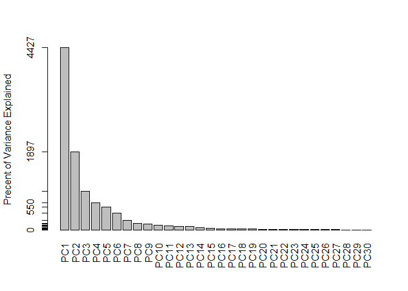
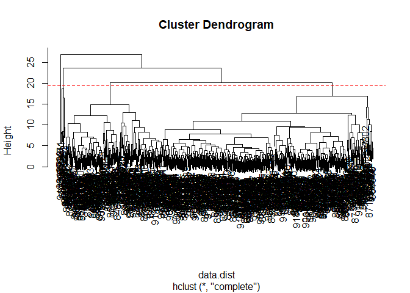
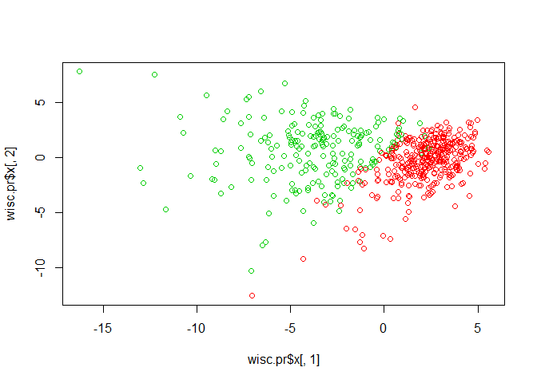
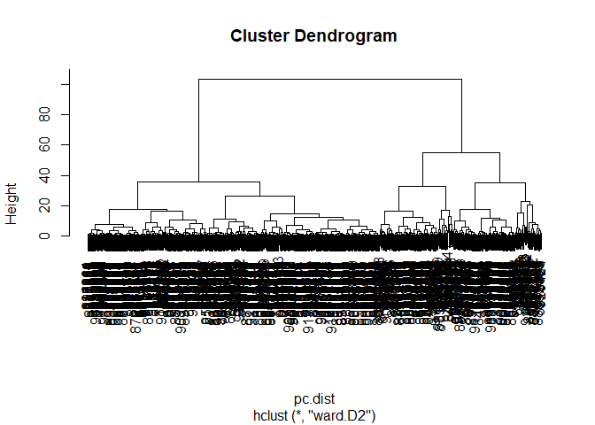
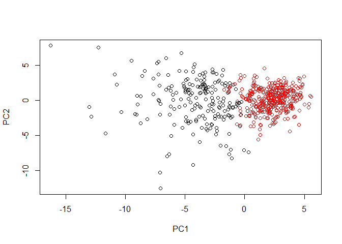
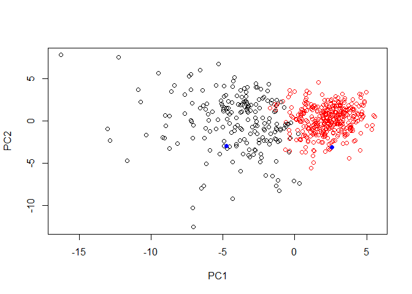

class09
================
Zhuohang Wu
February 7, 2019

``` r
wisc.df <- read.csv("WisconsinCancer.csv")

wisc.data <- as.matrix(wisc.df[,3:32])
row.names(wisc.data) <- wisc.df$id
diagnosis <- as.numeric(wisc.df$diagnosis)
table(wisc.df$diagnosis)
```

    ## 
    ##   B   M 
    ## 357 212

``` r
View(diagnosis)
```

``` r
tmp <- rep(0,nrow(wisc.df))
as.numeric(wisc.df$diagnosis=="M")
```

    ##   [1] 1 1 1 1 1 1 1 1 1 1 1 1 1 1 1 1 1 1 1 0 0 0 1 1 1 1 1 1 1 1 1 1 1 1 1
    ##  [36] 1 1 0 1 1 1 1 1 1 1 1 0 1 0 0 0 0 0 1 1 0 1 1 0 0 0 0 1 0 1 1 0 0 0 0
    ##  [71] 1 0 1 1 0 1 0 1 1 0 0 0 1 1 0 1 1 1 0 0 0 1 0 0 1 1 0 0 0 1 1 0 0 0 0
    ## [106] 1 0 0 1 0 0 0 0 0 0 0 0 1 1 1 0 1 1 0 0 0 1 1 0 1 0 1 1 0 1 1 0 0 1 0
    ## [141] 0 1 0 0 0 0 1 0 0 0 0 0 0 0 0 0 1 0 0 0 0 1 1 0 1 0 0 1 1 0 0 1 1 0 0
    ## [176] 0 0 1 0 0 1 1 1 0 1 0 1 0 0 0 1 0 0 1 1 0 1 1 1 1 0 1 1 1 0 1 0 1 0 0
    ## [211] 1 0 1 1 1 1 0 0 1 1 0 0 0 1 0 0 0 0 0 1 1 0 0 1 0 0 1 1 0 1 0 0 0 0 1
    ## [246] 0 0 0 0 0 1 0 1 1 1 1 1 1 1 1 1 1 1 1 1 1 0 0 0 0 0 0 1 0 1 0 0 1 0 0
    ## [281] 1 0 1 1 0 0 0 0 0 0 0 0 0 0 0 0 0 1 0 0 1 0 1 0 0 0 0 0 0 0 0 0 0 0 0
    ## [316] 0 0 1 0 0 0 1 0 1 0 0 0 0 1 1 1 0 0 0 0 1 0 1 0 1 0 0 0 1 0 0 0 0 0 0
    ## [351] 0 1 1 1 0 0 0 0 0 0 0 0 0 0 0 1 1 0 1 1 1 0 1 1 0 0 0 0 0 1 0 0 0 0 0
    ## [386] 1 0 0 0 1 0 0 1 1 0 0 0 0 0 0 1 0 0 0 0 0 0 0 1 0 0 0 0 0 1 0 0 1 0 0
    ## [421] 0 0 0 0 0 0 0 0 0 0 1 0 1 1 0 1 0 0 0 0 0 1 0 0 1 0 1 0 0 1 0 1 0 0 0
    ## [456] 0 0 0 0 0 1 1 0 0 0 0 0 0 1 0 0 0 0 0 0 0 0 0 0 1 0 0 0 0 0 0 0 1 0 1
    ## [491] 0 0 1 0 0 0 0 0 1 1 0 1 0 1 0 0 0 0 0 1 0 0 1 0 1 0 1 1 0 0 0 1 0 0 0
    ## [526] 0 0 0 0 0 0 0 0 1 0 1 1 0 0 0 0 0 0 0 0 0 0 0 0 0 0 0 0 0 0 0 0 0 0 0
    ## [561] 0 0 1 1 1 1 1 1 0

``` r
cbind(diagnosis,wisc.df$diagnosis)
```

    ##        diagnosis  
    ##   [1,]         2 2
    ##   [2,]         2 2
    ##   [3,]         2 2
    ##   [4,]         2 2
    ##   [5,]         2 2
    ##   [6,]         2 2
    ##   [7,]         2 2
    ##   [8,]         2 2
    ##   [9,]         2 2
    ##  [10,]         2 2
    ##  [11,]         2 2
    ##  [12,]         2 2
    ##  [13,]         2 2
    ##  [14,]         2 2
    ##  [15,]         2 2
    ##  [16,]         2 2
    ##  [17,]         2 2
    ##  [18,]         2 2
    ##  [19,]         2 2
    ##  [20,]         1 1
    ##  [21,]         1 1
    ##  [22,]         1 1
    ##  [23,]         2 2
    ##  [24,]         2 2
    ##  [25,]         2 2
    ##  [26,]         2 2
    ##  [27,]         2 2
    ##  [28,]         2 2
    ##  [29,]         2 2
    ##  [30,]         2 2
    ##  [31,]         2 2
    ##  [32,]         2 2
    ##  [33,]         2 2
    ##  [34,]         2 2
    ##  [35,]         2 2
    ##  [36,]         2 2
    ##  [37,]         2 2
    ##  [38,]         1 1
    ##  [39,]         2 2
    ##  [40,]         2 2
    ##  [41,]         2 2
    ##  [42,]         2 2
    ##  [43,]         2 2
    ##  [44,]         2 2
    ##  [45,]         2 2
    ##  [46,]         2 2
    ##  [47,]         1 1
    ##  [48,]         2 2
    ##  [49,]         1 1
    ##  [50,]         1 1
    ##  [51,]         1 1
    ##  [52,]         1 1
    ##  [53,]         1 1
    ##  [54,]         2 2
    ##  [55,]         2 2
    ##  [56,]         1 1
    ##  [57,]         2 2
    ##  [58,]         2 2
    ##  [59,]         1 1
    ##  [60,]         1 1
    ##  [61,]         1 1
    ##  [62,]         1 1
    ##  [63,]         2 2
    ##  [64,]         1 1
    ##  [65,]         2 2
    ##  [66,]         2 2
    ##  [67,]         1 1
    ##  [68,]         1 1
    ##  [69,]         1 1
    ##  [70,]         1 1
    ##  [71,]         2 2
    ##  [72,]         1 1
    ##  [73,]         2 2
    ##  [74,]         2 2
    ##  [75,]         1 1
    ##  [76,]         2 2
    ##  [77,]         1 1
    ##  [78,]         2 2
    ##  [79,]         2 2
    ##  [80,]         1 1
    ##  [81,]         1 1
    ##  [82,]         1 1
    ##  [83,]         2 2
    ##  [84,]         2 2
    ##  [85,]         1 1
    ##  [86,]         2 2
    ##  [87,]         2 2
    ##  [88,]         2 2
    ##  [89,]         1 1
    ##  [90,]         1 1
    ##  [91,]         1 1
    ##  [92,]         2 2
    ##  [93,]         1 1
    ##  [94,]         1 1
    ##  [95,]         2 2
    ##  [96,]         2 2
    ##  [97,]         1 1
    ##  [98,]         1 1
    ##  [99,]         1 1
    ## [100,]         2 2
    ## [101,]         2 2
    ## [102,]         1 1
    ## [103,]         1 1
    ## [104,]         1 1
    ## [105,]         1 1
    ## [106,]         2 2
    ## [107,]         1 1
    ## [108,]         1 1
    ## [109,]         2 2
    ## [110,]         1 1
    ## [111,]         1 1
    ## [112,]         1 1
    ## [113,]         1 1
    ## [114,]         1 1
    ## [115,]         1 1
    ## [116,]         1 1
    ## [117,]         1 1
    ## [118,]         2 2
    ## [119,]         2 2
    ## [120,]         2 2
    ## [121,]         1 1
    ## [122,]         2 2
    ## [123,]         2 2
    ## [124,]         1 1
    ## [125,]         1 1
    ## [126,]         1 1
    ## [127,]         2 2
    ## [128,]         2 2
    ## [129,]         1 1
    ## [130,]         2 2
    ## [131,]         1 1
    ## [132,]         2 2
    ## [133,]         2 2
    ## [134,]         1 1
    ## [135,]         2 2
    ## [136,]         2 2
    ## [137,]         1 1
    ## [138,]         1 1
    ## [139,]         2 2
    ## [140,]         1 1
    ## [141,]         1 1
    ## [142,]         2 2
    ## [143,]         1 1
    ## [144,]         1 1
    ## [145,]         1 1
    ## [146,]         1 1
    ## [147,]         2 2
    ## [148,]         1 1
    ## [149,]         1 1
    ## [150,]         1 1
    ## [151,]         1 1
    ## [152,]         1 1
    ## [153,]         1 1
    ## [154,]         1 1
    ## [155,]         1 1
    ## [156,]         1 1
    ## [157,]         2 2
    ## [158,]         1 1
    ## [159,]         1 1
    ## [160,]         1 1
    ## [161,]         1 1
    ## [162,]         2 2
    ## [163,]         2 2
    ## [164,]         1 1
    ## [165,]         2 2
    ## [166,]         1 1
    ## [167,]         1 1
    ## [168,]         2 2
    ## [169,]         2 2
    ## [170,]         1 1
    ## [171,]         1 1
    ## [172,]         2 2
    ## [173,]         2 2
    ## [174,]         1 1
    ## [175,]         1 1
    ## [176,]         1 1
    ## [177,]         1 1
    ## [178,]         2 2
    ## [179,]         1 1
    ## [180,]         1 1
    ## [181,]         2 2
    ## [182,]         2 2
    ## [183,]         2 2
    ## [184,]         1 1
    ## [185,]         2 2
    ## [186,]         1 1
    ## [187,]         2 2
    ## [188,]         1 1
    ## [189,]         1 1
    ## [190,]         1 1
    ## [191,]         2 2
    ## [192,]         1 1
    ## [193,]         1 1
    ## [194,]         2 2
    ## [195,]         2 2
    ## [196,]         1 1
    ## [197,]         2 2
    ## [198,]         2 2
    ## [199,]         2 2
    ## [200,]         2 2
    ## [201,]         1 1
    ## [202,]         2 2
    ## [203,]         2 2
    ## [204,]         2 2
    ## [205,]         1 1
    ## [206,]         2 2
    ## [207,]         1 1
    ## [208,]         2 2
    ## [209,]         1 1
    ## [210,]         1 1
    ## [211,]         2 2
    ## [212,]         1 1
    ## [213,]         2 2
    ## [214,]         2 2
    ## [215,]         2 2
    ## [216,]         2 2
    ## [217,]         1 1
    ## [218,]         1 1
    ## [219,]         2 2
    ## [220,]         2 2
    ## [221,]         1 1
    ## [222,]         1 1
    ## [223,]         1 1
    ## [224,]         2 2
    ## [225,]         1 1
    ## [226,]         1 1
    ## [227,]         1 1
    ## [228,]         1 1
    ## [229,]         1 1
    ## [230,]         2 2
    ## [231,]         2 2
    ## [232,]         1 1
    ## [233,]         1 1
    ## [234,]         2 2
    ## [235,]         1 1
    ## [236,]         1 1
    ## [237,]         2 2
    ## [238,]         2 2
    ## [239,]         1 1
    ## [240,]         2 2
    ## [241,]         1 1
    ## [242,]         1 1
    ## [243,]         1 1
    ## [244,]         1 1
    ## [245,]         2 2
    ## [246,]         1 1
    ## [247,]         1 1
    ## [248,]         1 1
    ## [249,]         1 1
    ## [250,]         1 1
    ## [251,]         2 2
    ## [252,]         1 1
    ## [253,]         2 2
    ## [254,]         2 2
    ## [255,]         2 2
    ## [256,]         2 2
    ## [257,]         2 2
    ## [258,]         2 2
    ## [259,]         2 2
    ## [260,]         2 2
    ## [261,]         2 2
    ## [262,]         2 2
    ## [263,]         2 2
    ## [264,]         2 2
    ## [265,]         2 2
    ## [266,]         2 2
    ## [267,]         1 1
    ## [268,]         1 1
    ## [269,]         1 1
    ## [270,]         1 1
    ## [271,]         1 1
    ## [272,]         1 1
    ## [273,]         2 2
    ## [274,]         1 1
    ## [275,]         2 2
    ## [276,]         1 1
    ## [277,]         1 1
    ## [278,]         2 2
    ## [279,]         1 1
    ## [280,]         1 1
    ## [281,]         2 2
    ## [282,]         1 1
    ## [283,]         2 2
    ## [284,]         2 2
    ## [285,]         1 1
    ## [286,]         1 1
    ## [287,]         1 1
    ## [288,]         1 1
    ## [289,]         1 1
    ## [290,]         1 1
    ## [291,]         1 1
    ## [292,]         1 1
    ## [293,]         1 1
    ## [294,]         1 1
    ## [295,]         1 1
    ## [296,]         1 1
    ## [297,]         1 1
    ## [298,]         2 2
    ## [299,]         1 1
    ## [300,]         1 1
    ## [301,]         2 2
    ## [302,]         1 1
    ## [303,]         2 2
    ## [304,]         1 1
    ## [305,]         1 1
    ## [306,]         1 1
    ## [307,]         1 1
    ## [308,]         1 1
    ## [309,]         1 1
    ## [310,]         1 1
    ## [311,]         1 1
    ## [312,]         1 1
    ## [313,]         1 1
    ## [314,]         1 1
    ## [315,]         1 1
    ## [316,]         1 1
    ## [317,]         1 1
    ## [318,]         2 2
    ## [319,]         1 1
    ## [320,]         1 1
    ## [321,]         1 1
    ## [322,]         2 2
    ## [323,]         1 1
    ## [324,]         2 2
    ## [325,]         1 1
    ## [326,]         1 1
    ## [327,]         1 1
    ## [328,]         1 1
    ## [329,]         2 2
    ## [330,]         2 2
    ## [331,]         2 2
    ## [332,]         1 1
    ## [333,]         1 1
    ## [334,]         1 1
    ## [335,]         1 1
    ## [336,]         2 2
    ## [337,]         1 1
    ## [338,]         2 2
    ## [339,]         1 1
    ## [340,]         2 2
    ## [341,]         1 1
    ## [342,]         1 1
    ## [343,]         1 1
    ## [344,]         2 2
    ## [345,]         1 1
    ## [346,]         1 1
    ## [347,]         1 1
    ## [348,]         1 1
    ## [349,]         1 1
    ## [350,]         1 1
    ## [351,]         1 1
    ## [352,]         2 2
    ## [353,]         2 2
    ## [354,]         2 2
    ## [355,]         1 1
    ## [356,]         1 1
    ## [357,]         1 1
    ## [358,]         1 1
    ## [359,]         1 1
    ## [360,]         1 1
    ## [361,]         1 1
    ## [362,]         1 1
    ## [363,]         1 1
    ## [364,]         1 1
    ## [365,]         1 1
    ## [366,]         2 2
    ## [367,]         2 2
    ## [368,]         1 1
    ## [369,]         2 2
    ## [370,]         2 2
    ## [371,]         2 2
    ## [372,]         1 1
    ## [373,]         2 2
    ## [374,]         2 2
    ## [375,]         1 1
    ## [376,]         1 1
    ## [377,]         1 1
    ## [378,]         1 1
    ## [379,]         1 1
    ## [380,]         2 2
    ## [381,]         1 1
    ## [382,]         1 1
    ## [383,]         1 1
    ## [384,]         1 1
    ## [385,]         1 1
    ## [386,]         2 2
    ## [387,]         1 1
    ## [388,]         1 1
    ## [389,]         1 1
    ## [390,]         2 2
    ## [391,]         1 1
    ## [392,]         1 1
    ## [393,]         2 2
    ## [394,]         2 2
    ## [395,]         1 1
    ## [396,]         1 1
    ## [397,]         1 1
    ## [398,]         1 1
    ## [399,]         1 1
    ## [400,]         1 1
    ## [401,]         2 2
    ## [402,]         1 1
    ## [403,]         1 1
    ## [404,]         1 1
    ## [405,]         1 1
    ## [406,]         1 1
    ## [407,]         1 1
    ## [408,]         1 1
    ## [409,]         2 2
    ## [410,]         1 1
    ## [411,]         1 1
    ## [412,]         1 1
    ## [413,]         1 1
    ## [414,]         1 1
    ## [415,]         2 2
    ## [416,]         1 1
    ## [417,]         1 1
    ## [418,]         2 2
    ## [419,]         1 1
    ## [420,]         1 1
    ## [421,]         1 1
    ## [422,]         1 1
    ## [423,]         1 1
    ## [424,]         1 1
    ## [425,]         1 1
    ## [426,]         1 1
    ## [427,]         1 1
    ## [428,]         1 1
    ## [429,]         1 1
    ## [430,]         1 1
    ## [431,]         2 2
    ## [432,]         1 1
    ## [433,]         2 2
    ## [434,]         2 2
    ## [435,]         1 1
    ## [436,]         2 2
    ## [437,]         1 1
    ## [438,]         1 1
    ## [439,]         1 1
    ## [440,]         1 1
    ## [441,]         1 1
    ## [442,]         2 2
    ## [443,]         1 1
    ## [444,]         1 1
    ## [445,]         2 2
    ## [446,]         1 1
    ## [447,]         2 2
    ## [448,]         1 1
    ## [449,]         1 1
    ## [450,]         2 2
    ## [451,]         1 1
    ## [452,]         2 2
    ## [453,]         1 1
    ## [454,]         1 1
    ## [455,]         1 1
    ## [456,]         1 1
    ## [457,]         1 1
    ## [458,]         1 1
    ## [459,]         1 1
    ## [460,]         1 1
    ## [461,]         2 2
    ## [462,]         2 2
    ## [463,]         1 1
    ## [464,]         1 1
    ## [465,]         1 1
    ## [466,]         1 1
    ## [467,]         1 1
    ## [468,]         1 1
    ## [469,]         2 2
    ## [470,]         1 1
    ## [471,]         1 1
    ## [472,]         1 1
    ## [473,]         1 1
    ## [474,]         1 1
    ## [475,]         1 1
    ## [476,]         1 1
    ## [477,]         1 1
    ## [478,]         1 1
    ## [479,]         1 1
    ## [480,]         2 2
    ## [481,]         1 1
    ## [482,]         1 1
    ## [483,]         1 1
    ## [484,]         1 1
    ## [485,]         1 1
    ## [486,]         1 1
    ## [487,]         1 1
    ## [488,]         2 2
    ## [489,]         1 1
    ## [490,]         2 2
    ## [491,]         1 1
    ## [492,]         1 1
    ## [493,]         2 2
    ## [494,]         1 1
    ## [495,]         1 1
    ## [496,]         1 1
    ## [497,]         1 1
    ## [498,]         1 1
    ## [499,]         2 2
    ## [500,]         2 2
    ## [501,]         1 1
    ## [502,]         2 2
    ## [503,]         1 1
    ## [504,]         2 2
    ## [505,]         1 1
    ## [506,]         1 1
    ## [507,]         1 1
    ## [508,]         1 1
    ## [509,]         1 1
    ## [510,]         2 2
    ## [511,]         1 1
    ## [512,]         1 1
    ## [513,]         2 2
    ## [514,]         1 1
    ## [515,]         2 2
    ## [516,]         1 1
    ## [517,]         2 2
    ## [518,]         2 2
    ## [519,]         1 1
    ## [520,]         1 1
    ## [521,]         1 1
    ## [522,]         2 2
    ## [523,]         1 1
    ## [524,]         1 1
    ## [525,]         1 1
    ## [526,]         1 1
    ## [527,]         1 1
    ## [528,]         1 1
    ## [529,]         1 1
    ## [530,]         1 1
    ## [531,]         1 1
    ## [532,]         1 1
    ## [533,]         1 1
    ## [534,]         2 2
    ## [535,]         1 1
    ## [536,]         2 2
    ## [537,]         2 2
    ## [538,]         1 1
    ## [539,]         1 1
    ## [540,]         1 1
    ## [541,]         1 1
    ## [542,]         1 1
    ## [543,]         1 1
    ## [544,]         1 1
    ## [545,]         1 1
    ## [546,]         1 1
    ## [547,]         1 1
    ## [548,]         1 1
    ## [549,]         1 1
    ## [550,]         1 1
    ## [551,]         1 1
    ## [552,]         1 1
    ## [553,]         1 1
    ## [554,]         1 1
    ## [555,]         1 1
    ## [556,]         1 1
    ## [557,]         1 1
    ## [558,]         1 1
    ## [559,]         1 1
    ## [560,]         1 1
    ## [561,]         1 1
    ## [562,]         1 1
    ## [563,]         2 2
    ## [564,]         2 2
    ## [565,]         2 2
    ## [566,]         2 2
    ## [567,]         2 2
    ## [568,]         2 2
    ## [569,]         1 1

``` r
colMeans(wisc.data)
```

    ##             radius_mean            texture_mean          perimeter_mean 
    ##            1.412729e+01            1.928965e+01            9.196903e+01 
    ##               area_mean         smoothness_mean        compactness_mean 
    ##            6.548891e+02            9.636028e-02            1.043410e-01 
    ##          concavity_mean     concave.points_mean           symmetry_mean 
    ##            8.879932e-02            4.891915e-02            1.811619e-01 
    ##  fractal_dimension_mean               radius_se              texture_se 
    ##            6.279761e-02            4.051721e-01            1.216853e+00 
    ##            perimeter_se                 area_se           smoothness_se 
    ##            2.866059e+00            4.033708e+01            7.040979e-03 
    ##          compactness_se            concavity_se       concave.points_se 
    ##            2.547814e-02            3.189372e-02            1.179614e-02 
    ##             symmetry_se    fractal_dimension_se            radius_worst 
    ##            2.054230e-02            3.794904e-03            1.626919e+01 
    ##           texture_worst         perimeter_worst              area_worst 
    ##            2.567722e+01            1.072612e+02            8.805831e+02 
    ##        smoothness_worst       compactness_worst         concavity_worst 
    ##            1.323686e-01            2.542650e-01            2.721885e-01 
    ##    concave.points_worst          symmetry_worst fractal_dimension_worst 
    ##            1.146062e-01            2.900756e-01            8.394582e-02

``` r
apply(wisc.data,2,sd)
```

    ##             radius_mean            texture_mean          perimeter_mean 
    ##            3.524049e+00            4.301036e+00            2.429898e+01 
    ##               area_mean         smoothness_mean        compactness_mean 
    ##            3.519141e+02            1.406413e-02            5.281276e-02 
    ##          concavity_mean     concave.points_mean           symmetry_mean 
    ##            7.971981e-02            3.880284e-02            2.741428e-02 
    ##  fractal_dimension_mean               radius_se              texture_se 
    ##            7.060363e-03            2.773127e-01            5.516484e-01 
    ##            perimeter_se                 area_se           smoothness_se 
    ##            2.021855e+00            4.549101e+01            3.002518e-03 
    ##          compactness_se            concavity_se       concave.points_se 
    ##            1.790818e-02            3.018606e-02            6.170285e-03 
    ##             symmetry_se    fractal_dimension_se            radius_worst 
    ##            8.266372e-03            2.646071e-03            4.833242e+00 
    ##           texture_worst         perimeter_worst              area_worst 
    ##            6.146258e+00            3.360254e+01            5.693570e+02 
    ##        smoothness_worst       compactness_worst         concavity_worst 
    ##            2.283243e-02            1.573365e-01            2.086243e-01 
    ##    concave.points_worst          symmetry_worst fractal_dimension_worst 
    ##            6.573234e-02            6.186747e-02            1.806127e-02

``` r
wisc.pr <- prcomp(wisc.data, scale=TRUE)
summary(wisc.pr)
```

    ## Importance of components:
    ##                           PC1    PC2     PC3     PC4     PC5     PC6
    ## Standard deviation     3.6444 2.3857 1.67867 1.40735 1.28403 1.09880
    ## Proportion of Variance 0.4427 0.1897 0.09393 0.06602 0.05496 0.04025
    ## Cumulative Proportion  0.4427 0.6324 0.72636 0.79239 0.84734 0.88759
    ##                            PC7     PC8    PC9    PC10   PC11    PC12
    ## Standard deviation     0.82172 0.69037 0.6457 0.59219 0.5421 0.51104
    ## Proportion of Variance 0.02251 0.01589 0.0139 0.01169 0.0098 0.00871
    ## Cumulative Proportion  0.91010 0.92598 0.9399 0.95157 0.9614 0.97007
    ##                           PC13    PC14    PC15    PC16    PC17    PC18
    ## Standard deviation     0.49128 0.39624 0.30681 0.28260 0.24372 0.22939
    ## Proportion of Variance 0.00805 0.00523 0.00314 0.00266 0.00198 0.00175
    ## Cumulative Proportion  0.97812 0.98335 0.98649 0.98915 0.99113 0.99288
    ##                           PC19    PC20   PC21    PC22    PC23   PC24
    ## Standard deviation     0.22244 0.17652 0.1731 0.16565 0.15602 0.1344
    ## Proportion of Variance 0.00165 0.00104 0.0010 0.00091 0.00081 0.0006
    ## Cumulative Proportion  0.99453 0.99557 0.9966 0.99749 0.99830 0.9989
    ##                           PC25    PC26    PC27    PC28    PC29    PC30
    ## Standard deviation     0.12442 0.09043 0.08307 0.03987 0.02736 0.01153
    ## Proportion of Variance 0.00052 0.00027 0.00023 0.00005 0.00002 0.00000
    ## Cumulative Proportion  0.99942 0.99969 0.99992 0.99997 1.00000 1.00000

``` r
biplot(wisc.pr)
```


``` r
plot(wisc.pr$x[,1],wisc.pr$x[,2],col=diagnosis+1, xlab = "PC1",ylab = "PC2")
```


``` r
varance <- wisc.pr$sdev^2
pve <- varance/sum(varance)*100
head(varance)
```

    ## [1] 13.281608  5.691355  2.817949  1.980640  1.648731  1.207357

``` r
barplot(pve, ylab = "Precent of Variance Explained",
     names.arg=paste0("PC",1:length(pve)), las=2, axes = FALSE)
axis(2, at=pve, labels=round(pve,2)*100 )
```



``` r
data.scaled <- scale(wisc.data)
data.dist <- dist(data.scaled)
wisc.hclust <- hclust(data.dist, method = "complete")
plot(wisc.hclust)
abline(h=19.4, col="red", lty=2)
```



``` r
plot(wisc.pr$x[,1],wisc.pr$x[,2], col=diagnosis+1)
```



``` r
pc.dist <- dist(wisc.pr$x[,1:3])
pc.hclust <- hclust(pc.dist, method="ward.D2")
plot(pc.hclust)
```



``` r
grps <- cutree(pc.hclust, k=2)
table(grps,diagnosis)
```

    ##     diagnosis
    ## grps   1   2
    ##    1  24 179
    ##    2 333  33

``` r
plot(wisc.pr$x[,1:2], col=grps)
```



``` r
new <- read.csv("new_samples.csv")
npc <- predict(wisc.pr, newdata=new)
npc
```

    ##            PC1       PC2        PC3        PC4       PC5        PC6
    ## [1,]  2.576616 -3.135913  1.3990492 -0.7631950  2.781648 -0.8150185
    ## [2,] -4.754928 -3.009033 -0.1660946 -0.6052952 -1.140698 -1.2189945
    ##             PC7        PC8       PC9       PC10      PC11      PC12
    ## [1,] -0.3959098 -0.2307350 0.1029569 -0.9272861 0.3411457  0.375921
    ## [2,]  0.8193031 -0.3307423 0.5281896 -0.4855301 0.7173233 -1.185917
    ##           PC13     PC14      PC15       PC16        PC17        PC18
    ## [1,] 0.1610764 1.187882 0.3216974 -0.1743616 -0.07875393 -0.11207028
    ## [2,] 0.5893856 0.303029 0.1299153  0.1448061 -0.40509706  0.06565549
    ##             PC19       PC20       PC21       PC22       PC23       PC24
    ## [1,] -0.08802955 -0.2495216  0.1228233 0.09358453 0.08347651  0.1223396
    ## [2,]  0.25591230 -0.4289500 -0.1224776 0.01732146 0.06316631 -0.2338618
    ##             PC25         PC26         PC27        PC28         PC29
    ## [1,]  0.02124121  0.078884581  0.220199544 -0.02946023 -0.015620933
    ## [2,] -0.20755948 -0.009833238 -0.001134152  0.09638361  0.002795349
    ##              PC30
    ## [1,]  0.005269029
    ## [2,] -0.019015820

``` r
plot(wisc.pr$x[,1:2], col=grps)
points(npc[,1], npc[,2], col="blue", pch=16)
```


