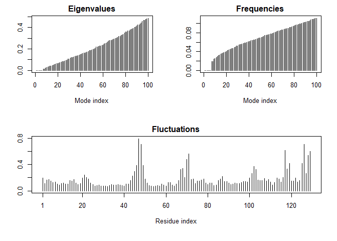

class13
================
Zhuohang Wu
February 19, 2019

``` r
library(bio3d)
file.name <- get.pdb("1hsg")
```

    ## Warning in get.pdb("1hsg"): ./1hsg.pdb exists. Skipping download

``` r
hiv <- read.pdb(file.name)
```

``` r
hiv
```

    ## 
    ##  Call:  read.pdb(file = file.name)
    ## 
    ##    Total Models#: 1
    ##      Total Atoms#: 1686,  XYZs#: 5058  Chains#: 2  (values: A B)
    ## 
    ##      Protein Atoms#: 1514  (residues/Calpha atoms#: 198)
    ##      Nucleic acid Atoms#: 0  (residues/phosphate atoms#: 0)
    ## 
    ##      Non-protein/nucleic Atoms#: 172  (residues: 128)
    ##      Non-protein/nucleic resid values: [ HOH (127), MK1 (1) ]
    ## 
    ##    Protein sequence:
    ##       PQITLWQRPLVTIKIGGQLKEALLDTGADDTVLEEMSLPGRWKPKMIGGIGGFIKVRQYD
    ##       QILIEICGHKAIGTVLVGPTPVNIIGRNLLTQIGCTLNFPQITLWQRPLVTIKIGGQLKE
    ##       ALLDTGADDTVLEEMSLPGRWKPKMIGGIGGFIKVRQYDQILIEICGHKAIGTVLVGPTP
    ##       VNIIGRNLLTQIGCTLNF
    ## 
    ## + attr: atom, xyz, seqres, helix, sheet,
    ##         calpha, remark, call

``` r
prot <- trim.pdb(hiv,"protein")
lig <- trim.pdb(hiv,"ligand")
write.pdb(prot, file="1hsg_protein.pdb")
write.pdb(lig, file="1hsg_ligand.pdb")
```

``` r
library(bio3d)
res <- read.pdb("all.pdbqt", multi=TRUE)
write.pdb(res, "results.pdb")
```

``` r
res <- read.pdb("all.pdbqt", multi=TRUE)
ori <- read.pdb("1hsg_ligand.pdbqt")
result <- rmsd(ori, res)
```

``` r
pdb <- read.pdb("1HEL")
```

    ##   Note: Accessing on-line PDB file

``` r
m <- nma(pdb)
```

    ##  Building Hessian...     Done in 0.02 seconds.
    ##  Diagonalizing Hessian...    Done in 0.09 seconds.

``` r
plot(m)
```



``` r
mktrj(m,mode=7,file="nma_7.pdb")
```
