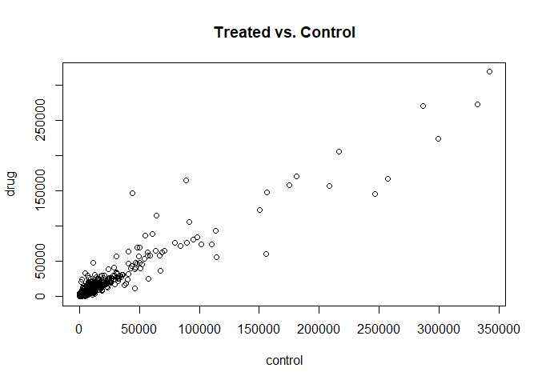
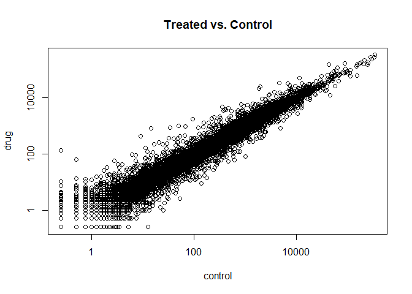
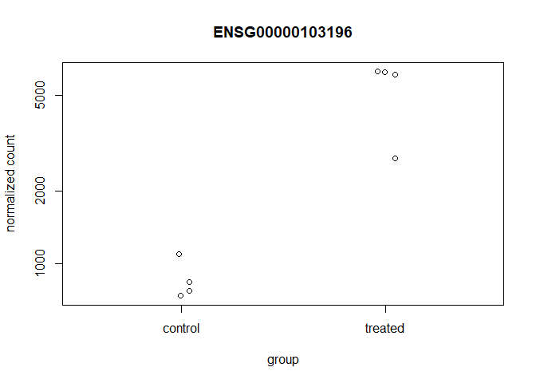
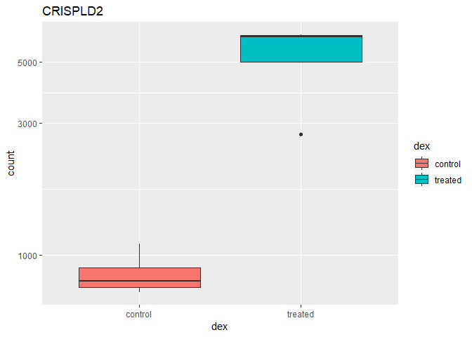
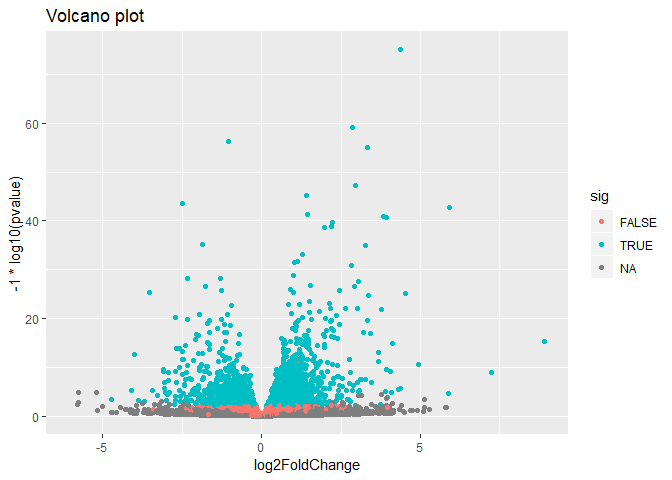

class15
================
Zhuohang Wu
February 26, 2019

``` r
counts <- read.csv("data/airway_scaledcounts.csv", stringsAsFactors = FALSE)
metadata <-  read.csv("data/airway_metadata.csv", stringsAsFactors = FALSE)
```

``` r
head(counts)
```

    ##           ensgene SRR1039508 SRR1039509 SRR1039512 SRR1039513 SRR1039516
    ## 1 ENSG00000000003        723        486        904        445       1170
    ## 2 ENSG00000000005          0          0          0          0          0
    ## 3 ENSG00000000419        467        523        616        371        582
    ## 4 ENSG00000000457        347        258        364        237        318
    ## 5 ENSG00000000460         96         81         73         66        118
    ## 6 ENSG00000000938          0          0          1          0          2
    ##   SRR1039517 SRR1039520 SRR1039521
    ## 1       1097        806        604
    ## 2          0          0          0
    ## 3        781        417        509
    ## 4        447        330        324
    ## 5         94        102         74
    ## 6          0          0          0

``` r
head(metadata)
```

    ##           id     dex celltype     geo_id
    ## 1 SRR1039508 control   N61311 GSM1275862
    ## 2 SRR1039509 treated   N61311 GSM1275863
    ## 3 SRR1039512 control  N052611 GSM1275866
    ## 4 SRR1039513 treated  N052611 GSM1275867
    ## 5 SRR1039516 control  N080611 GSM1275870
    ## 6 SRR1039517 treated  N080611 GSM1275871

``` r
control.inds <- metadata$dex=="control"
control.ids <- metadata$id[control.inds]
head(counts[,control.ids])
```

    ##   SRR1039508 SRR1039512 SRR1039516 SRR1039520
    ## 1        723        904       1170        806
    ## 2          0          0          0          0
    ## 3        467        616        582        417
    ## 4        347        364        318        330
    ## 5         96         73        118        102
    ## 6          0          1          2          0

``` r
control.mean <- rowSums(counts[,control.ids])/ncol(counts[,control.ids])
head(control.mean)
```

    ## [1] 900.75   0.00 520.50 339.75  97.25   0.75

``` r
names(control.mean) <- counts$ensgene
```

``` r
drug.inds <- metadata$dex=="treated"
drug.ids <- metadata$id[drug.inds]
head(counts[,drug.ids])
```

    ##   SRR1039509 SRR1039513 SRR1039517 SRR1039521
    ## 1        486        445       1097        604
    ## 2          0          0          0          0
    ## 3        523        371        781        509
    ## 4        258        237        447        324
    ## 5         81         66         94         74
    ## 6          0          0          0          0

``` r
drug.mean <- rowSums(counts[,drug.ids])/ncol(counts[,drug.ids])
head(drug.mean)
```

    ## [1] 658.00   0.00 546.00 316.50  78.75   0.00

``` r
names(drug.mean) <- counts$ensgene
```

``` r
mean.counts <- data.frame(control.mean,drug.mean)
head(mean.counts)
```

    ##                 control.mean drug.mean
    ## ENSG00000000003       900.75    658.00
    ## ENSG00000000005         0.00      0.00
    ## ENSG00000000419       520.50    546.00
    ## ENSG00000000457       339.75    316.50
    ## ENSG00000000460        97.25     78.75
    ## ENSG00000000938         0.75      0.00

``` r
plot(control.mean,drug.mean,xlab = "control",ylab = "drug",main = "Treated vs. Control")
```



``` r
plot(control.mean,drug.mean,log="xy",xlab = "control",ylab = "drug",main = "Treated vs. Control")
```

    ## Warning in xy.coords(x, y, xlabel, ylabel, log): 15032 x values <= 0
    ## omitted from logarithmic plot

    ## Warning in xy.coords(x, y, xlabel, ylabel, log): 15281 y values <= 0
    ## omitted from logarithmic plot



We can find candidate differentially expressed genes by looking for genes with a large change between control and dex-treated samples. We usually look at the log2 of the fold change, because this has better mathematical properties.

Here we calculate log2foldchange, add it to our meancounts data.frame and inspect the results either with the head() or the View() function for example.

``` r
mean.counts$log2fc <- log2(mean.counts[,"drug.mean"]/mean.counts[,"control.mean"])
head(mean.counts)
```

    ##                 control.mean drug.mean      log2fc
    ## ENSG00000000003       900.75    658.00 -0.45303916
    ## ENSG00000000005         0.00      0.00         NaN
    ## ENSG00000000419       520.50    546.00  0.06900279
    ## ENSG00000000457       339.75    316.50 -0.10226805
    ## ENSG00000000460        97.25     78.75 -0.30441833
    ## ENSG00000000938         0.75      0.00        -Inf

``` r
t.test(control.mean,drug.mean)
```

    ## 
    ##  Welch Two Sample t-test
    ## 
    ## data:  control.mean and drug.mean
    ## t = 0.58915, df = 76401, p-value = 0.5558
    ## alternative hypothesis: true difference in means is not equal to 0
    ## 95 percent confidence interval:
    ##  -48.63581  90.44074
    ## sample estimates:
    ## mean of x mean of y 
    ##  594.5450  573.6425

``` r
zero.vals <- which(mean.counts[,1:2]==0, arr.ind=TRUE)
```

``` r
to.rm <- unique(zero.vals[,1])
mycounts <- mean.counts[-to.rm,]
head(mycounts)
```

    ##                 control.mean drug.mean      log2fc
    ## ENSG00000000003       900.75    658.00 -0.45303916
    ## ENSG00000000419       520.50    546.00  0.06900279
    ## ENSG00000000457       339.75    316.50 -0.10226805
    ## ENSG00000000460        97.25     78.75 -0.30441833
    ## ENSG00000000971      5219.00   6687.50  0.35769358
    ## ENSG00000001036      2327.00   1785.75 -0.38194109

``` r
up.ind <- mycounts$log2fc > 2
down.ind <- mycounts$log2fc < (-2)
```

``` r
head(mycounts[up.ind,])
```

    ##                 control.mean drug.mean   log2fc
    ## ENSG00000004799       270.50   1429.25 2.401558
    ## ENSG00000006788         2.75     19.75 2.844349
    ## ENSG00000008438         0.50      2.75 2.459432
    ## ENSG00000011677         0.50      2.25 2.169925
    ## ENSG00000015413         0.50      3.00 2.584963
    ## ENSG00000015592         0.50      2.25 2.169925

``` r
head(mycounts[down.ind,])
```

    ##                 control.mean drug.mean    log2fc
    ## ENSG00000015520        32.00      6.00 -2.415037
    ## ENSG00000019186        26.50      1.75 -3.920566
    ## ENSG00000025423       295.00     54.25 -2.443020
    ## ENSG00000028277        88.25     22.00 -2.004093
    ## ENSG00000029559         1.25      0.25 -2.321928
    ## ENSG00000049246       405.00     93.00 -2.122619

``` r
sum(up.ind)
```

    ## [1] 250

``` r
sum(down.ind)
```

    ## [1] 367

``` r
anno <- read.csv("data/annotables_grch38.csv")
head(anno)
```

    ##           ensgene entrez   symbol chr     start       end strand
    ## 1 ENSG00000000003   7105   TSPAN6   X 100627109 100639991     -1
    ## 2 ENSG00000000005  64102     TNMD   X 100584802 100599885      1
    ## 3 ENSG00000000419   8813     DPM1  20  50934867  50958555     -1
    ## 4 ENSG00000000457  57147    SCYL3   1 169849631 169894267     -1
    ## 5 ENSG00000000460  55732 C1orf112   1 169662007 169854080      1
    ## 6 ENSG00000000938   2268      FGR   1  27612064  27635277     -1
    ##          biotype
    ## 1 protein_coding
    ## 2 protein_coding
    ## 3 protein_coding
    ## 4 protein_coding
    ## 5 protein_coding
    ## 6 protein_coding
    ##                                                                                                  description
    ## 1                                                          tetraspanin 6 [Source:HGNC Symbol;Acc:HGNC:11858]
    ## 2                                                            tenomodulin [Source:HGNC Symbol;Acc:HGNC:17757]
    ## 3 dolichyl-phosphate mannosyltransferase polypeptide 1, catalytic subunit [Source:HGNC Symbol;Acc:HGNC:3005]
    ## 4                                               SCY1-like, kinase-like 3 [Source:HGNC Symbol;Acc:HGNC:19285]
    ## 5                                    chromosome 1 open reading frame 112 [Source:HGNC Symbol;Acc:HGNC:25565]
    ## 6                          FGR proto-oncogene, Src family tyrosine kinase [Source:HGNC Symbol;Acc:HGNC:3697]

``` r
head(mycounts)
```

    ##                 control.mean drug.mean      log2fc
    ## ENSG00000000003       900.75    658.00 -0.45303916
    ## ENSG00000000419       520.50    546.00  0.06900279
    ## ENSG00000000457       339.75    316.50 -0.10226805
    ## ENSG00000000460        97.25     78.75 -0.30441833
    ## ENSG00000000971      5219.00   6687.50  0.35769358
    ## ENSG00000001036      2327.00   1785.75 -0.38194109

``` r
#head(mycounts)
my.count.annotated <- merge(x=mycounts, y= anno, by.x = "row.names", by.y = "ensgene")
head(my.count.annotated)
```

    ##         Row.names control.mean drug.mean      log2fc entrez   symbol chr
    ## 1 ENSG00000000003       900.75    658.00 -0.45303916   7105   TSPAN6   X
    ## 2 ENSG00000000419       520.50    546.00  0.06900279   8813     DPM1  20
    ## 3 ENSG00000000457       339.75    316.50 -0.10226805  57147    SCYL3   1
    ## 4 ENSG00000000460        97.25     78.75 -0.30441833  55732 C1orf112   1
    ## 5 ENSG00000000971      5219.00   6687.50  0.35769358   3075      CFH   1
    ## 6 ENSG00000001036      2327.00   1785.75 -0.38194109   2519    FUCA2   6
    ##       start       end strand        biotype
    ## 1 100627109 100639991     -1 protein_coding
    ## 2  50934867  50958555     -1 protein_coding
    ## 3 169849631 169894267     -1 protein_coding
    ## 4 169662007 169854080      1 protein_coding
    ## 5 196651878 196747504      1 protein_coding
    ## 6 143494811 143511690     -1 protein_coding
    ##                                                                                                  description
    ## 1                                                          tetraspanin 6 [Source:HGNC Symbol;Acc:HGNC:11858]
    ## 2 dolichyl-phosphate mannosyltransferase polypeptide 1, catalytic subunit [Source:HGNC Symbol;Acc:HGNC:3005]
    ## 3                                               SCY1-like, kinase-like 3 [Source:HGNC Symbol;Acc:HGNC:19285]
    ## 4                                    chromosome 1 open reading frame 112 [Source:HGNC Symbol;Acc:HGNC:25565]
    ## 5                                                     complement factor H [Source:HGNC Symbol;Acc:HGNC:4883]
    ## 6                                          fucosidase, alpha-L- 2, plasma [Source:HGNC Symbol;Acc:HGNC:4008]

``` r
library(DESeq2)
```

    ## Loading required package: S4Vectors

    ## Loading required package: stats4

    ## Loading required package: BiocGenerics

    ## Loading required package: parallel

    ## 
    ## Attaching package: 'BiocGenerics'

    ## The following objects are masked from 'package:parallel':
    ## 
    ##     clusterApply, clusterApplyLB, clusterCall, clusterEvalQ,
    ##     clusterExport, clusterMap, parApply, parCapply, parLapply,
    ##     parLapplyLB, parRapply, parSapply, parSapplyLB

    ## The following objects are masked from 'package:stats':
    ## 
    ##     IQR, mad, sd, var, xtabs

    ## The following objects are masked from 'package:base':
    ## 
    ##     anyDuplicated, append, as.data.frame, basename, cbind,
    ##     colMeans, colnames, colSums, dirname, do.call, duplicated,
    ##     eval, evalq, Filter, Find, get, grep, grepl, intersect,
    ##     is.unsorted, lapply, lengths, Map, mapply, match, mget, order,
    ##     paste, pmax, pmax.int, pmin, pmin.int, Position, rank, rbind,
    ##     Reduce, rowMeans, rownames, rowSums, sapply, setdiff, sort,
    ##     table, tapply, union, unique, unsplit, which, which.max,
    ##     which.min

    ## 
    ## Attaching package: 'S4Vectors'

    ## The following object is masked from 'package:base':
    ## 
    ##     expand.grid

    ## Loading required package: IRanges

    ## 
    ## Attaching package: 'IRanges'

    ## The following object is masked from 'package:grDevices':
    ## 
    ##     windows

    ## Loading required package: GenomicRanges

    ## Loading required package: GenomeInfoDb

    ## Loading required package: SummarizedExperiment

    ## Loading required package: Biobase

    ## Welcome to Bioconductor
    ## 
    ##     Vignettes contain introductory material; view with
    ##     'browseVignettes()'. To cite Bioconductor, see
    ##     'citation("Biobase")', and for packages 'citation("pkgname")'.

    ## Loading required package: DelayedArray

    ## Loading required package: matrixStats

    ## 
    ## Attaching package: 'matrixStats'

    ## The following objects are masked from 'package:Biobase':
    ## 
    ##     anyMissing, rowMedians

    ## Loading required package: BiocParallel

    ## 
    ## Attaching package: 'DelayedArray'

    ## The following objects are masked from 'package:matrixStats':
    ## 
    ##     colMaxs, colMins, colRanges, rowMaxs, rowMins, rowRanges

    ## The following objects are masked from 'package:base':
    ## 
    ##     aperm, apply

``` r
citation("DESeq2")
```

    ## 
    ##   Love, M.I., Huber, W., Anders, S. Moderated estimation of fold
    ##   change and dispersion for RNA-seq data with DESeq2 Genome
    ##   Biology 15(12):550 (2014)
    ## 
    ## A BibTeX entry for LaTeX users is
    ## 
    ##   @Article{,
    ##     title = {Moderated estimation of fold change and dispersion for RNA-seq data with DESeq2},
    ##     author = {Michael I. Love and Wolfgang Huber and Simon Anders},
    ##     year = {2014},
    ##     journal = {Genome Biology},
    ##     doi = {10.1186/s13059-014-0550-8},
    ##     volume = {15},
    ##     issue = {12},
    ##     pages = {550},
    ##   }

``` r
dds <- DESeqDataSetFromMatrix(countData=counts, 
                              colData=metadata, 
                              design=~dex, 
                              tidy=TRUE)
```

    ## converting counts to integer mode

    ## Warning in DESeqDataSet(se, design = design, ignoreRank): some variables in
    ## design formula are characters, converting to factors

``` r
dds
```

    ## class: DESeqDataSet 
    ## dim: 38694 8 
    ## metadata(1): version
    ## assays(1): counts
    ## rownames(38694): ENSG00000000003 ENSG00000000005 ...
    ##   ENSG00000283120 ENSG00000283123
    ## rowData names(0):
    ## colnames(8): SRR1039508 SRR1039509 ... SRR1039520 SRR1039521
    ## colData names(4): id dex celltype geo_id

``` r
dds <- DESeq(dds)
```

    ## estimating size factors

    ## estimating dispersions

    ## gene-wise dispersion estimates

    ## mean-dispersion relationship

    ## final dispersion estimates

    ## fitting model and testing

``` r
res <- results(dds)
res
```

    ## log2 fold change (MLE): dex treated vs control 
    ## Wald test p-value: dex treated vs control 
    ## DataFrame with 38694 rows and 6 columns
    ##                          baseMean     log2FoldChange             lfcSE
    ##                         <numeric>          <numeric>         <numeric>
    ## ENSG00000000003  747.194195359907  -0.35070296228142 0.168242083227575
    ## ENSG00000000005                 0                 NA                NA
    ## ENSG00000000419  520.134160051965  0.206107283859668 0.101041504451637
    ## ENSG00000000457  322.664843927049 0.0245270113332215 0.145133863749003
    ## ENSG00000000460   87.682625164828 -0.147142630021569  0.25699544204927
    ## ...                           ...                ...               ...
    ## ENSG00000283115                 0                 NA                NA
    ## ENSG00000283116                 0                 NA                NA
    ## ENSG00000283119                 0                 NA                NA
    ## ENSG00000283120 0.974916032393564 -0.668250141508022  1.69441251902782
    ## ENSG00000283123                 0                 NA                NA
    ##                               stat             pvalue              padj
    ##                          <numeric>          <numeric>         <numeric>
    ## ENSG00000000003  -2.08451390730246 0.0371134465299012 0.163017154203989
    ## ENSG00000000005                 NA                 NA                NA
    ## ENSG00000000419   2.03982793979795 0.0413674659663301 0.175936611081177
    ## ENSG00000000457  0.168995785681273  0.865799956262632 0.961682459669788
    ## ENSG00000000460  -0.57254957071713  0.566949713034425 0.815805192488045
    ## ...                            ...                ...               ...
    ## ENSG00000283115                 NA                 NA                NA
    ## ENSG00000283116                 NA                 NA                NA
    ## ENSG00000283119                 NA                 NA                NA
    ## ENSG00000283120 -0.394384563383323  0.693297138831059                NA
    ## ENSG00000283123                 NA                 NA                NA

``` r
summary(res)
```

    ## 
    ## out of 25258 with nonzero total read count
    ## adjusted p-value < 0.1
    ## LFC > 0 (up)       : 1564, 6.2%
    ## LFC < 0 (down)     : 1188, 4.7%
    ## outliers [1]       : 142, 0.56%
    ## low counts [2]     : 9971, 39%
    ## (mean count < 10)
    ## [1] see 'cooksCutoff' argument of ?results
    ## [2] see 'independentFiltering' argument of ?results

``` r
res01 <- results(dds, alpha=0.01)
summary(res01)
```

    ## 
    ## out of 25258 with nonzero total read count
    ## adjusted p-value < 0.01
    ## LFC > 0 (up)       : 850, 3.4%
    ## LFC < 0 (down)     : 581, 2.3%
    ## outliers [1]       : 142, 0.56%
    ## low counts [2]     : 9033, 36%
    ## (mean count < 6)
    ## [1] see 'cooksCutoff' argument of ?results
    ## [2] see 'independentFiltering' argument of ?results

``` r
plot(res$log2FoldChange, -log(res$padj))
```


``` r
resSig01 <- subset(as.data.frame(res), padj < 0.01)
nrow(resSig01)
```

    ## [1] 1437

``` r
#resSig01 <- subset(as.data.frame(res), padj < 0.01)
#nrow(resSig01)
ord <- order( resSig01$padj )
View(res01[ord,])
head(resSig01[ord,])
```

    ##                   baseMean log2FoldChange      lfcSE      stat
    ## ENSG00000152583   954.7709       4.368359 0.23713055  18.42175
    ## ENSG00000179094   743.2527       2.863889 0.17556588  16.31233
    ## ENSG00000116584  2277.9135      -1.034700 0.06508256 -15.89828
    ## ENSG00000189221  2383.7537       3.341544 0.21240908  15.73164
    ## ENSG00000120129  3440.7038       2.965211 0.20369778  14.55691
    ## ENSG00000148175 13493.9204       1.427168 0.10038114  14.21749
    ##                       pvalue         padj
    ## ENSG00000152583 8.792137e-76 1.331569e-71
    ## ENSG00000179094 8.065679e-60 6.107735e-56
    ## ENSG00000116584 6.513169e-57 3.288065e-53
    ## ENSG00000189221 9.179598e-56 3.475625e-52
    ## ENSG00000120129 5.278831e-48 1.598958e-44
    ## ENSG00000148175 7.136249e-46 1.801308e-42

``` r
#resSig01$
head(resSig01[ord,])
```

    ##                   baseMean log2FoldChange      lfcSE      stat
    ## ENSG00000152583   954.7709       4.368359 0.23713055  18.42175
    ## ENSG00000179094   743.2527       2.863889 0.17556588  16.31233
    ## ENSG00000116584  2277.9135      -1.034700 0.06508256 -15.89828
    ## ENSG00000189221  2383.7537       3.341544 0.21240908  15.73164
    ## ENSG00000120129  3440.7038       2.965211 0.20369778  14.55691
    ## ENSG00000148175 13493.9204       1.427168 0.10038114  14.21749
    ##                       pvalue         padj
    ## ENSG00000152583 8.792137e-76 1.331569e-71
    ## ENSG00000179094 8.065679e-60 6.107735e-56
    ## ENSG00000116584 6.513169e-57 3.288065e-53
    ## ENSG00000189221 9.179598e-56 3.475625e-52
    ## ENSG00000120129 5.278831e-48 1.598958e-44
    ## ENSG00000148175 7.136249e-46 1.801308e-42

``` r
head(anno)
```

    ##           ensgene entrez   symbol chr     start       end strand
    ## 1 ENSG00000000003   7105   TSPAN6   X 100627109 100639991     -1
    ## 2 ENSG00000000005  64102     TNMD   X 100584802 100599885      1
    ## 3 ENSG00000000419   8813     DPM1  20  50934867  50958555     -1
    ## 4 ENSG00000000457  57147    SCYL3   1 169849631 169894267     -1
    ## 5 ENSG00000000460  55732 C1orf112   1 169662007 169854080      1
    ## 6 ENSG00000000938   2268      FGR   1  27612064  27635277     -1
    ##          biotype
    ## 1 protein_coding
    ## 2 protein_coding
    ## 3 protein_coding
    ## 4 protein_coding
    ## 5 protein_coding
    ## 6 protein_coding
    ##                                                                                                  description
    ## 1                                                          tetraspanin 6 [Source:HGNC Symbol;Acc:HGNC:11858]
    ## 2                                                            tenomodulin [Source:HGNC Symbol;Acc:HGNC:17757]
    ## 3 dolichyl-phosphate mannosyltransferase polypeptide 1, catalytic subunit [Source:HGNC Symbol;Acc:HGNC:3005]
    ## 4                                               SCY1-like, kinase-like 3 [Source:HGNC Symbol;Acc:HGNC:19285]
    ## 5                                    chromosome 1 open reading frame 112 [Source:HGNC Symbol;Acc:HGNC:25565]
    ## 6                          FGR proto-oncogene, Src family tyrosine kinase [Source:HGNC Symbol;Acc:HGNC:3697]

``` r
resSig01<-merge(x=resSig01[ord,], y=anno, by.x="row.names", by.y="ensgene")
head(resSig01)
```

    ##         Row.names  baseMean log2FoldChange      lfcSE      stat
    ## 1 ENSG00000002834 8609.1828      0.4168750 0.10828988  3.849621
    ## 2 ENSG00000003096  414.0753     -0.9645787 0.19173837 -5.030703
    ## 3 ENSG00000003402 3368.7234      1.1624996 0.12613296  9.216462
    ## 4 ENSG00000004059 1684.3218      0.3796899 0.11418622  3.325181
    ## 5 ENSG00000004487 1255.8003     -0.3341060 0.09602713 -3.479287
    ## 6 ENSG00000004700 1510.2085      0.4095532 0.11915479  3.437153
    ##         pvalue         padj entrez symbol chr     start       end strand
    ## 1 1.183006e-04 1.828505e-03   3927  LASP1  17  38869859  38921770      1
    ## 2 4.886858e-07 1.492167e-05  90293 KLHL13   X 117897813 118117340     -1
    ## 3 3.070661e-20 7.882231e-18   8837  CFLAR   2 201116104 201176687      1
    ## 4 8.836103e-04 9.404271e-03    381   ARF5   7 127588345 127591705      1
    ## 5 5.027495e-04 6.023845e-03  23028  KDM1A   1  23019448  23083689      1
    ## 6 5.878631e-04 6.769328e-03   5965  RECQL  12  21468911  21501669     -1
    ##          biotype
    ## 1 protein_coding
    ## 2 protein_coding
    ## 3 protein_coding
    ## 4 protein_coding
    ## 5 protein_coding
    ## 6 protein_coding
    ##                                                                  description
    ## 1                   LIM and SH3 protein 1 [Source:HGNC Symbol;Acc:HGNC:6513]
    ## 2            kelch-like family member 13 [Source:HGNC Symbol;Acc:HGNC:22931]
    ## 3 CASP8 and FADD-like apoptosis regulator [Source:HGNC Symbol;Acc:HGNC:1876]
    ## 4                ADP-ribosylation factor 5 [Source:HGNC Symbol;Acc:HGNC:658]
    ## 5     lysine (K)-specific demethylase 1A [Source:HGNC Symbol;Acc:HGNC:29079]
    ## 6                      RecQ helicase-like [Source:HGNC Symbol;Acc:HGNC:9948]

``` r
write.csv(resSig01[ord,], "signif01_results.csv")
```

``` r
i <- grep("CRISPLD2", resSig01$symbol)
resSig01[i,]
```

    ##           Row.names baseMean log2FoldChange     lfcSE     stat
    ## 264 ENSG00000103196 3096.159       2.626034 0.2674536 9.818655
    ##           pvalue         padj entrez   symbol chr    start      end strand
    ## 264 9.358392e-23 3.374591e-20  83716 CRISPLD2  16 84819984 84920768      1
    ##            biotype
    ## 264 protein_coding
    ##                                                                                      description
    ## 264 cysteine-rich secretory protein LCCL domain containing 2 [Source:HGNC Symbol;Acc:HGNC:25248]

``` r
plotCounts(dds, gene="ENSG00000103196", intgroup="dex")
```



``` r
d <- plotCounts(dds, gene="ENSG00000103196", intgroup="dex", returnData=TRUE)
head(d)
```

    ##                count     dex
    ## SRR1039508  774.5002 control
    ## SRR1039509 6258.7915 treated
    ## SRR1039512 1100.2741 control
    ## SRR1039513 6093.0324 treated
    ## SRR1039516  736.9483 control
    ## SRR1039517 2742.1908 treated

``` r
boxplot(count ~ dex , data=d)
```


``` r
library(ggplot2)
ggplot(d, aes(dex, count)) + geom_boxplot(aes(fill=dex)) + scale_y_log10() + ggtitle("CRISPLD2")
```



``` r
res$sig <- res$padj<0.05
table(res$sig)
```

    ## 
    ## FALSE  TRUE 
    ## 12964  2181

``` r
sum(is.na(res$sig))
```

    ## [1] 23549

``` r
library(ggplot2)

ggplot(as.data.frame(res), aes(log2FoldChange, -1*log10(pvalue), col=sig)) + 
    geom_point() + 
    ggtitle("Volcano plot")
```

    ## Warning: Removed 13578 rows containing missing values (geom_point).


